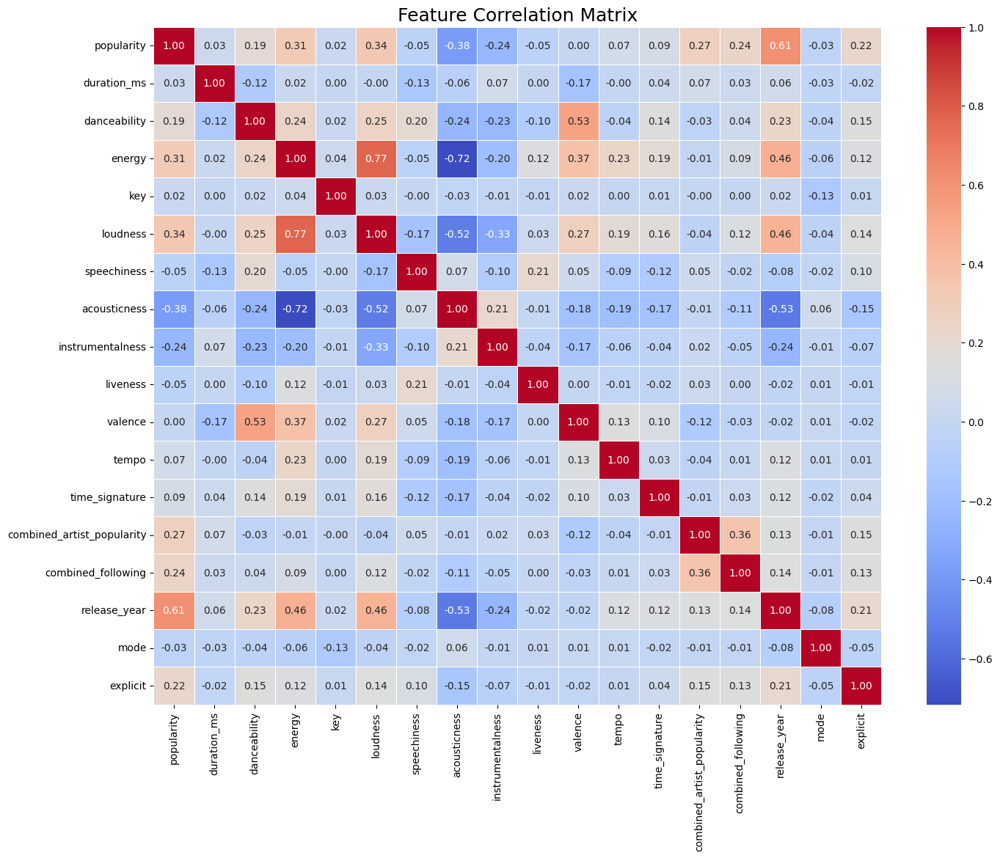

# Spotify Song Popularity Prediction

## Project Goal
The goal of this project is to build a machine learning model using regression algorithms that predicts the popularity score of a song based on its audio features and artist information.

---
## Dataset
The dataset was sourced from Kaggle and includes `tracks.csv` and `artists.csv`.

*(Note: Due to file size, the data is not included in this repository but can be downloaded from [here](https://www.kaggle.com/datasets/yamaerenay/spotify-dataset-19212020-600k-tracks) and placed in a `data/` folder.)*

---
## Installation & Setup
1.  Clone the repository:
    ```bash
    git clone gh repo clone j-ar7/spotify-song-popularity-prediction
    cd spotify-song-popularity-prediction
    ```
2.  Create and activate a virtual environment:
    ```bash
    python3 -m venv venv
    source venv/bin/activate
    ```
3.  Install the required dependencies:
    ```bash
    pip install -r requirements.txt
    ```

---

## Usage
The project is divided into three main scripts that should be run in order:
1.  **Data Preprocessing & EDA**: `python scripts/01_eda.py`
2.  **Model Training**: `python scripts/02_train.py`
3.  **Figures & Reports**: `python scripts/03_reports.py`

---
## Project Workflow

### 1. Data Preprocessing (`01_eda.py`)
-   **Load & Clean**: The script begins by loading the raw `artists.csv` and `tracks.csv` files.
-   **Feature Engineering**: Instead of a simple merge, this script creates efficient lookup dictionaries (maps) for artist attributes. It then generates three powerful new features for each track:
    -   `combined_artist_popularity`: The sum of popularity scores of all artists on a track.
    -   `combined_following`: The sum of followers of all artists on a track.
    -   `combined_genres`: A complete list of all unique genres associated with the track's artists.
-   **Multi-Hot Encoding**: To handle multiple genres per song, the script identifies the top **N=1500** (out of 4672) most frequent genres and performs multi-hot encoding, creating a wide DataFrame with binary features for each of these top genres.
-   **Finalization**: The script extracts the `release_year` from the release date and handles missing values for the new combined features before saving the final, model-ready dataset to `processed_data/model_data.csv`.

### 2. Model Training (`02_train.py`)
-   **Data Preparation**: This script loads the clean, pre-encoded data from the previous step.
-   **Splitting & Scaling**: The data is split into 80% for training and 20% for testing. The script then scales all numerical features using `StandardScaler`.
-   **Training**: A `RandomForestRegressor` model with 100 estimators is trained on the prepared data.
-   **Evaluation**: The model's performance is evaluated on the unseen test set, and its RMSE and R-squared scores are printed to the console.
-   **Saving**: The trained model and the scaler object are saved to the `saved_models/` directory using `joblib` for later use.

### 3. Report Generation (`03_reports.py`)
-   **Load Assets**: This final script loads the saved Random Forest model, scaler, and the clean dataset.
-   **Generate Visuals**: It uses the loaded model and test data to generate three key visualizations:
    1.  A **Feature Correlation Heatmap** to analyze relationships between variables.
    2.  A bar chart of the **Top 15 Most Important Features** for predicting popularity.
    3.  A scatter plot comparing the **Actual vs. Predicted Popularity** scores.
-   **Save Reports**: All plots are saved as `.png` files to the `figures/` directory.

---
## Model Performance

Several regression models were trained, with the **Random Forest Regressor** (`n_estimators=200, N=1200`) selected as the final model due to its superior predictive accuracy.
-   **RMSE**: 9.02
-   **R-squared (R²)**: 0.76

The scatter plot below visualizes the model's predictions against the actual popularity scores, with the red line indicating a perfect prediction.


#### Implications
-   An **RMSE of 9.02** means the model's predictions are, on average, off by about 9.02 points on the 0-100 popularity scale.
-   An **R-squared of 0.76* indicates that the model can explain approximately **76%** of the variance in a song's popularity based on the features provided.

#### Model Comparison
A comparison of the initial models tested (before advanced feature engineering) is detailed below. Both tree-based ensemble models, LightGBM and Random Forest, significantly outperformed the Linear Regression baseline, indicating that the relationships between a song's features and its popularity are complex and non-linear.

Before new features:
- **Linear Regression**: RMSE 10.9, R-squared 0.64
- **LGBM (100 estimators)**: RMSE 10.1, R-squared 0.69
- **Random Forest (60 estimators)**: RMSE 9.16, R-squared 0.75

After new features:
- **Random Forest (60 estimators)**: RMSE 9.02, R-squared 0.76 (N = 800)
- **Random Forest (200 estimators)**: RMSE 8.92, R-squared 0.76 (N = 1200)

As you can see, the newly engineered features as well as **Genre factor N** had a significant impact on rmse and r-squared values.

---
## Analysis & Insights

### Feature Importance
The model identified several key drivers of song popularity. The engineered features `combined_following` and `combined_artist_popularity` were found to be highly significant, along with `release_year` and `instrumentalness`.


---
### Multicollinearity
A feature correlation heatmap was generated to investigate multicollinearity.

- **Findings**: The analysis revealed a strong positive correlation between `energy` and `loudness` (0.77) and a strong negative correlation between `energy` and `acousticness` (-0.72).
- **Impact**: While tree-based models like Random Forest are robust to multicollinearity's impact on predictive accuracy, this analysis confirms that these features provide redundant information. For a simpler, more interpretable model (like Linear Regression), removing one of these correlated features would be a necessary step.
