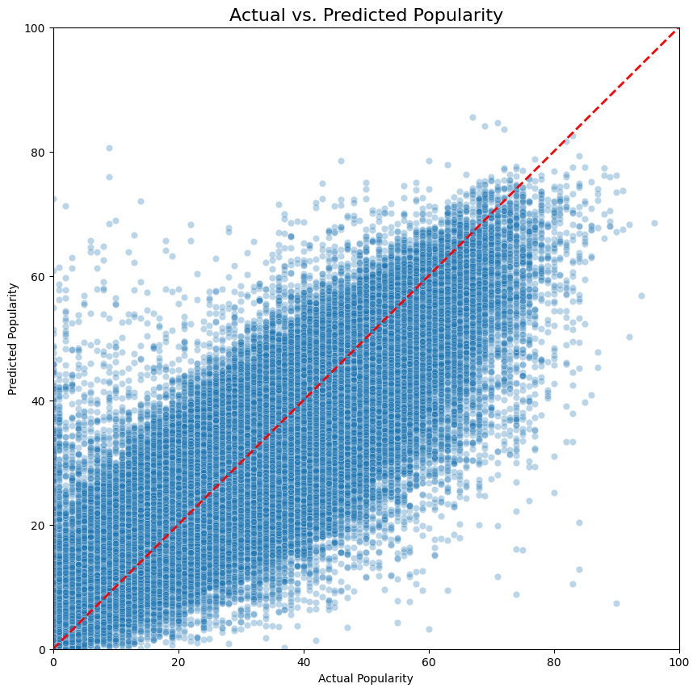
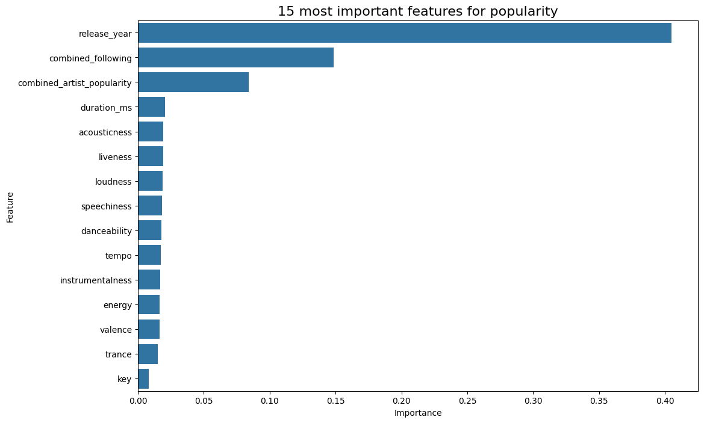

# Spotify Song Popularity Prediction

## Project Goal
The goal of this project is to build a machine learning model using regression algorithms that predicts the popularity score of a song based on its audio features and artist information.

---
## Dataset
The dataset was sourced from Kaggle and includes two main files: `tracks.csv` and `artists.csv`, containing detailed audio features and artist metrics.

*(Note: Due to file size, the data is not included in this repository but can be downloaded from [here](https://www.kaggle.com/datasets/yamaerenay/spotify-dataset-19212020-600k-tracks)).*

---
## Installation & Setup
To run this project, follow these steps:

1.  Clone the repository:
    ```bash
    git clone gh repo clone j-ar7/spotify-song-popularity-prediction
    cd spotify-song-popularity-prediction
    ```
2.  Create and activate a virtual environment:
    ```bash
    python3 -m venv venv
    source venv/bin/activate
    ```
3.  Install the required dependencies:
    ```bash
    pip install -r requirements.txt
    ```
4.  Download dataset from kaggle in ```./data```

---
## Usage
The project is divided into two main scripts that should be run in order: 
1. **Data Preprocessing & EDA**: `python scripts/01_eda.py` 
2. **Model Training**: `python scripts/02_train.py`
3. **Figures & Reports:** `python scripts/03_reports.py`

---
## Project Workflow

### 1. Data Preprocessing (`01_eda.py`)
- **Load & Clean**: The script begins by loading the raw `artists.csv` and `tracks.csv` files and immediately drops rows with missing track names, which were identified as pollutant entries.
- **Feature Extraction**: It processes the raw data to create valuable features. This includes extracting the primary artist ID, primary artist name, primary genre, and the release year from their respective complex string formats.
- **Data Integration**: The cleaned tracks data is then merged with the artists data based on the `primary_artist_id` to create a single, comprehensive DataFrame.
- **Imputation & Finalization**: Missing `followers` are filled with the median value, while the small number of rows missing `artist_popularity` are dropped. Finally, a specific set of 19 features is selected for the model, and the resulting clean DataFrame is saved to `processed_data/model_data.csv`.
### 2. Model Training (`02_train.py`)

- **Data Preparation**: This script loads the clean data, separates the features from the target (`track_popularity`), and performs one-hot encoding on the `primary_genre` column.
- **Splitting & Scaling**: The data is split into 80% for training and 20% for testing. The features are then scaled using `StandardScaler` to standardize their range.
- **Training**: A `RandomForestRegressor` model is trained on the prepared training data.
- **Evaluation**: The model's performance is evaluated on the unseen test set, and its RMSE and R-squared scores are printed to the console.
- **Saving**: The trained model and the scaler object are saved to the `saved_models/` directory using `joblib` for later use.
### 3. Report Generation (`03_reports.py`)

- **Load Assets**: This final script loads the saved Random Forest model, the scaler, and the clean dataset.
- **Generate Visuals**: It uses the loaded model and test data to generate two key visualizations:
    1. A bar chart of the **Top 10 Most Important Features** for predicting popularity.
    2. A scatter plot comparing the **Actual vs. Predicted Popularity** scores.
- **Save Reports**: Both plots are saved as `.png` files to the `figures/` directory, ready to be included in the `README.md` or other project documentation.

---

## Model Performance

Several regression models were trained to predict song popularity, with the **Random Forest Regressor** (`n_estimators=60`) selected as the final model due to its better accuracy.
- **RMSE**: 9.16
- **R-squared (R²)**: 0.75

The scatter plot below visualizes the model's predictions against the actual popularity scores, with the red line indicating a perfect prediction. 
#### Implications:
- An **RMSE of 9.16** means the model's predictions are, on average, off by about 9.16 points on the 0-100 popularity scale.
- An **R-squared of 0.75** indicates that the model can explain approximately **75%** of the variance in a song's popularity based on the features provided.
### Model Comparison
A comparison of all tested models is detailed below. Both tree-based ensemble models, LightGBM and Random Forest, significantly outperformed the Linear Regression baseline, indicating that the relationships between a song's features and its popularity are complex and non-linear.
- **Linear Regression**: RMSE 10.9, R-squared 0.64
- **LGBM (50 estimators)**: RMSE 10.4, R-squared 0.67
- **LGBM (100 estimators)**: RMSE 10.1, R-squared 0.69
- **Random Forest (40 estimators)**: RMSE 9.19, R-squared 0.74

---

## Key Features
The model identified several key drivers of song popularity. An artist's existing fame and the song's release year were found to be the most significant predictors. 
